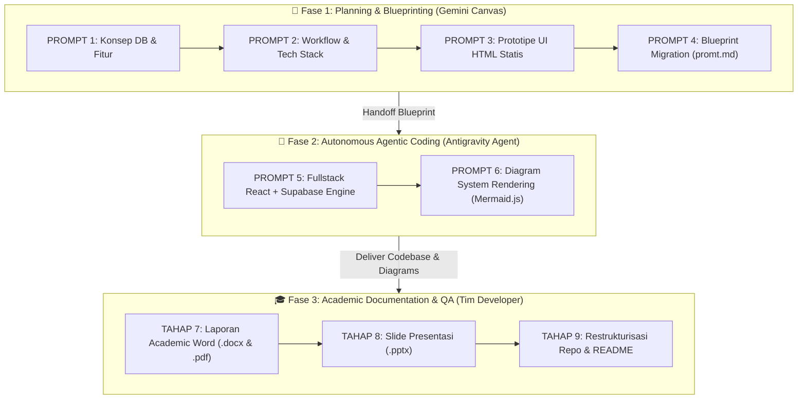
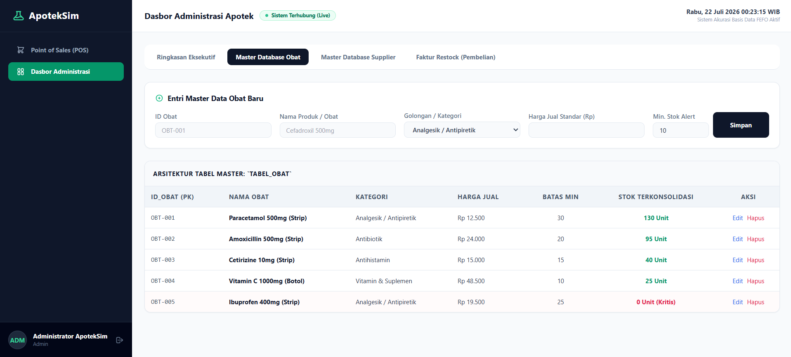

# 🤖 ApotekSim - Sistem Informasi Apotek Modern
### **AI-Driven Software Engineering & Multi-Batch FEFO Engine**

<div align="center">


### **Tugas Kuliah Project-Based Learning (PBL) - Universitas Dr. Soetomo (UNITOMO)**
**Pembangunan Sistem Informasi Apotek Modern Berbasis AI Assistant, Multi-Batch FEFO, POS Kasir, & Database Row Level Security (RLS)**

[](https://deepmind.google/)
[](https://gemini.google.com/)
[](https://react.dev/)
[](https://vitejs.dev/)
[](https://tailwindcss.com/)
[](https://supabase.com/)
[](https://www.typescriptlang.org/)

[🖥️ Interactive UI Prototype](docs/demo/index.html) • [📹 Video Demonstrasi (.mp4)](https://raw.githubusercontent.com/sahruulmubarokk-dot/Sistem-Informasi-Apotek/main/docs/reports/vidio-demonstrasi.mp4) • [📜 Master Prompt Pipeline](docs/notes/history-promt.md) • [📄 Laporan (.docx)](docs/reports/laporan_akhir_pbl_apotek.docx) • [📕 Laporan (.pdf)](docs/reports/laporan_akhir_pbl_apotek.pdf) • [📊 Slide Presentasi (.pptx)](docs/reports/presentasi-proyek.pptx)

---

</div>

## 📌 Latar Belakang & Pembuktian AI-Driven Engineering

Proyek **ApotekSim** dikembangkan sebagai bagian dari **Tugas Kuliah Project-Based Learning (PBL)** di **Universitas Dr. Soetomo (UNITOMO) Surabaya**. 

Fokus utama dari proyek ini adalah **mengimplementasikan Metodologi Pengembangan Perangkat Lunak Berbasis Kecerdasan Buatan (*AI-Driven Software Engineering & Prompt Engineering Pipeline*)**. Seluruh siklus pengembangan—mulai dari perancangan konsep arsitektur basis data, alur kerja bisnis, pembuatan prototipe UI HTML statis, refactoring kode ke Fullstack React + Supabase, hingga otomatisasi visualisasi diagram sistem—dieksekusi melalui kolaborasi terstruktur dengan **AI Agent**.

> [!NOTE]
> Metodologi AI-Driven Engineering membuktikan efisiensi tinggi dalam mentransformasikan ide bisnis apotek kompleks (seperti kalkulasi stok multi-batch FEFO & keamanan RLS) menjadi aplikasi web fullstack production-ready dalam waktu singkat.

### 🛠️ Peran & Matrix AI Tools yang Digunakan:

| Tool AI / Engine | Tahapan Prompting | Peran & Kontribusi Utama dalam Proyek |
| :--- | :---: | :--- |
| 🔵 **Gemini Canvas** | **Prompt 1 – 4** | Perancangan arsitektur basis data 3 tabel utama, penentuan alur kerja bisnis, pembuat prototipe UI HTML statis (`docs/demo/index.html`), dan penyusunan blueprint migrasi dinamis (`docs/notes/promt.md`). |
| 🤖 **Gemini + Claude (Antigravity Agent)** | **Prompt 5 – 6** | *Autonomous Agentic Coding* untuk refactoring Fullstack React + Supabase (CRUD Master Data, Realtime Subscription, RLS Security, & Stored Procedure RPC FEFO), serta otomatisasi diagram Mermaid interaktif. |
| 🧜‍♂️ **Mermaid.js Engine** | **Prompt 6** | Menghasilkan diagram visual sistem (Diagram Konteks, DFD Level 0, & ERD Database) secara terstruktur melalui sintaks deklaratif dalam renderer HTML. |

---

## 📜 Metodologi & Workflow Pengembangan

Pengembangan aplikasi memisahkan secara tegas antara **Fase Engineering Berbasis AI (Prompt Pipeline)** dan **Fase Penyusunan Berkas Akademik & Quality Assurance**.



---

### 📋 1. Matriks AI Prompt Engineering Pipeline (Prompt 1 – 6)

| Prompt | Fokus Development | Input & Prasyarat | Output Utama | Engine AI |
| :---: | :--- | :--- | :--- | :---: |
| **PROMPT 1** | **Arsitektur DB & Fitur** | Spesifikasi Bisnis Apotek | Schema 3 Tabel Utama & Blueprint Fitur Admin/Kasir | **Gemini Canvas** |
| **PROMPT 2** | **Workflow & Tech Stack** | Hasil Prompt 1 | Alur Bisnis Step-by-Step & Stack React + Supabase | **Gemini Canvas** |
| **PROMPT 3** | **UI Prototype HTML** | Hasil Prompt 1 & 2 | Single-file UI Prototype [`docs/demo/index.html`](docs/demo/index.html) | **Gemini Canvas** |
| **PROMPT 4** | **Blueprint Migration** | File `index.html` | Blueprint SoC & Analisis Celah [`docs/notes/promt.md`](docs/notes/promt.md) | **Gemini Canvas** |
| **PROMPT 5** | **Fullstack Execution** | `index.html` & `promt.md` | Aplikasi Web Dynamic di [`Frontend/`](Frontend/) & [`Backend/`](Backend/) | **Gemini + Claude Antigravity** |
| **PROMPT 6** | **Diagram Rendering** | Schema DB & Workflow | HTML Diagram Renderers di [`docs/diagrams_html/`](docs/diagrams_html/) | **Gemini + Claude Antigravity** |

---

### 📋 2. Matriks Tahapan Dokumentasi Akademik & QA (Tahap 7 – 9)

| Tahap | Fokus Pekerjaan | Input & Prasyarat | Output Berkas Akademik | Pelaksana |
| :---: | :--- | :--- | :--- | :---: |
| **TAHAP 7** | **Penyusunan Laporan Academic** | Data Proyek & Screenshot UI | Laporan Akhir PBL [`docs/reports/laporan_akhir_pbl_apotek.docx`](docs/reports/laporan_akhir_pbl_apotek.docx) & [PDF](docs/reports/laporan_akhir_pbl_apotek.pdf) | **Tim Developer** |
| **TAHAP 8** | **Desain Slide Presentasi** | Metrik & Visual System | Slide Presentasi Modern 16:9 [`docs/reports/presentasi-proyek.pptx`](docs/reports/presentasi-proyek.pptx) | **Tim Developer** |
| **TAHAP 9** | **Restrukturisasi Repo & QA** | Seluruh Berkas Proyek | Repositori Rapi, `.gitignore`, & [`README.md`](README.md) | **Tim Developer** |

> 💡 *Sintaks lengkap dan instruksi rinci dari setiap prompt dapat diakses di dokumen **[history-promt.md](docs/notes/history-promt.md)**.*

---

## ✨ Fitur Utama & Keunggulan Sistem

> [!TIP]
> **📦 Manajemen Stok Multi-Batch FEFO (*First Expired, First Out*)**
> Pengeluaran obat saat transaksi kasir dilakukan secara transaksional di level PostgreSQL server (*RPC Stored Procedure*). Sistem secara otomatis memotong stok dari batch dengan tanggal kedaluwarsa paling dekat untuk mencegah obat kedaluwarsa terdistribusi.

> [!NOTE]
> **🛒 Point of Sales (POS) Kasir & Validasi Obat Keras**
> Pencarian obat cepat berbasis barcode/nama, kalkulasi total harga otomatis, kembalian, serta modul skrining resep dokter untuk obat golongan Obat Keras (G) sebelum transaksi diselesaikan.

> [!IMPORTANT]
> **🛡️ PostgreSQL Row Level Security (RLS)**
> Keamanan data dijamin di tingkat database PostgreSQL:
> - **Role Kasir**: Hanya memiliki akses baca (*SELECT*) pada katalog obat & akses pemotongan stok transaksional via RPC.
> - **Role Admin**: Memiliki hak akses mutasi penuh (*INSERT, UPDATE, DELETE*) pada master obat, supplier, & faktur restock.

> [!NOTE]
> **📊 Dasbor Eksekutif & Early Warning Kedaluwarsa**
> Visualisasi indikator warna real-time untuk pemantauan stok kritis, peringatan obat mendekati expired (H-30/H-60), dan ringkasan grafik omset transaksi bulanan.

---

## 🖼️ Tampilan Antarmuka (UI Showcase)

<div align="center">

| Dasbor Utama Admin | Point of Sales (POS) Kasir |
| :---: | :---: |
|  |  |

| Master Data Katalog Obat | Faktur Pembelian (Restock) |
| :---: | :---: |
|  |  |

| Form Input & Modal Obat Baru | Laporan Penjualan & Analytics |
| :---: | :---: |
|  |  |

</div>

---

## 📐 Diagram Sistem & Perancangan Basis Data

<div align="center">

| 1. Diagram Konteks |
| :---: |
|  |
| *Batas sistem dan aliran interaksi antara Admin & Kasir dengan ApotekSim.*<br/>[🔗 Buka Interactive HTML Renderer](docs/diagrams_html/render_konteks.html) |

<br/>

| 2. Data Flow Diagram (DFD Level 0) |
| :---: |
|  |
| *Peta aliran data komprehensif: Restock Supplier, Multi-Batch Stok, POS Kasir, & Laporan Penjualan.*<br/>[🔗 Buka Interactive HTML Renderer](docs/diagrams_html/render_dfd0.html) |

<br/>

| 3. Entity Relationship Diagram (ERD Database) |
| :---: |
|  |
| *Struktur relasi PostgreSQL ter-normalisasi (Tabel Supplier, Obat, Batch Detail, & Transaksi).*<br/>[🔗 Buka Interactive HTML Renderer](docs/diagrams_html/render_erd.html) |

</div>

---

## 📁 Struktur Repositori Terorganisir

Repositori ini disusun secara modular dengan memisahkan aplikasi Frontend, konfigurasi Backend Supabase, serta dokumentasi proyek:

```gfm
Sistem-Informasi-Apotek/
├── Frontend/                   # Aplikasi Web React + Vite + Tailwind CSS + TypeScript
│   ├── src/
│   │   ├── components/         # Komponen UI Reusable (Navbar, Modal, Tables, Badges)
│   │   ├── pages/              # Halaman Dashboard, POS Kasir, Obat, Restock, Laporan
│   │   ├── services/           # Supabase Client SDK & Stored Procedure Calls
│   │   └── types/              # Definisi Tipe TypeScript Data Model
│   ├── package.json            # NPM Dependencies & Scripts
│   └── vite.config.ts          # Vite Configuration
├── Backend/                    # Backend Migration & Database Security
│   └── supabase/
│       ├── migrations/         # Script SQL: 0001_init.sql, 0002_triggers.sql, 0003_rpcs.sql
│       └── config.toml         # Config Local Supabase CLI
├── docs/                       # Dokumentasi Terstruktur & Artifact Proyek
│   ├── assets/                 # Screenshot UI Showcase & Animated GIF (.png/.gif)
│   ├── reports/                # Laporan PBL Word (.docx), PDF Ready-to-Print, & Presentasi (.pptx)
│   ├── diagrams_html/          # Renderer Diagram Mermaid.js (render_konteks.html, render_dfd0.html, render_erd.html)
│   ├── demo/                   # Prototype Standalone UI (index.html)
│   └── notes/                  # Master Prompt Engineering Guide (history-promt.md & promt.md)
├── .gitignore                  # Aturan pengabaian file temporary, env, & MS Office locks
└── README.md                   # Dokumentasi Utama Repositori (File Ini)
```

---

## 🚀 Panduan Memulai & Pengoperasian (Getting Started)

### **1. Prasyarat Sistem**
- **Node.js** v18.0 atau lebih baru dan `npm`
- **Supabase Cloud Project** (Database PostgreSQL Cloud)

---

### **2. Setup Database Supabase (Backend)**
1. Buat proyek baru di [Supabase Dashboard](https://supabase.com/).
2. Buka **SQL Editor** pada Supabase Dashboard Anda.
3. Jalankan script migrasi secara berurutan dari folder `Backend/supabase/migrations/`:
   - `0001_init.sql` (Membuat tabel master obat, supplier, batch, dan transaksi dengan RLS policies).
   - `0002_triggers.sql` (Membuat automatic updated_at timestamp triggers).
   - `0003_rpcs.sql` (Membuat stored procedure transaksional pemotongan stok FEFO `process_fefo_sale`).

---

### **3. Menjalankan Aplikasi Frontend (React + Vite)**

```bash
# 1. Masuk ke direktori Frontend
cd Frontend

# 2. Install seluruh dependensi
npm install

# 3. Salin dan sesuaikan environment variables
cp .env.example .env

# Biarkan variabel berikut diisi dengan kredensial Supabase Anda:
# VITE_SUPABASE_URL=https://xxxx.supabase.co
# VITE_SUPABASE_ANON_KEY=eyJhbGciOiJKV1Qi...

# 4. Jalankan server pengembangan lokal
npm run dev
```

Aplikasi akan berjalan di browser pada alamat **`http://localhost:5173`**.

---

### **4. Uji Coba Prototipe UI Standalone (Tanpa Installation)**

Anda dapat menguji antarmuka prototipe UI secara instan tanpa perlu menjalankan Node.js server:
- Cukup buka berkas **[`docs/demo/index.html`](docs/demo/index.html)** langsung di browser pilihan Anda.

---

## 📑 Indeks Dokumentasi & Artifact Proyek

- [📹 Video Demonstrasi Sistem (.mp4)](https://raw.githubusercontent.com/sahruulmubarokk-dot/Sistem-Informasi-Apotek/main/docs/reports/vidio-demonstrasi.mp4): Rekaman peragaan fitur role Admin & Kasir.
- [📜 Master Prompt Pipeline Guide](docs/notes/history-promt.md): Dokumentasi lengkap sintaks Prompt 1–6 & Tahap 7–9.
- [📄 Laporan Akhir PBL (.docx)](docs/reports/laporan_akhir_pbl_apotek.docx): Dokumen formal akademik MS Word.
- [📕 Laporan Akhir PBL (.pdf)](docs/reports/laporan_akhir_pbl_apotek.pdf): PDF Siap Cetak Laporan Akhir PBL.
- [📊 Slide Presentasi (.pptx)](docs/reports/presentasi-proyek.pptx): Presentation deck widescreen 16:9 berdesain modern.

---

## 🎓 Identitas Akademik & Universitas

- **Mata Kuliah**: Project-Based Learning (PBL) / Sistem Informasi
- **Institusi**: Universitas Dr. Soetomo (UNITOMO) Surabaya

<div align="center">

[](https://unitomo.ac.id/)

<sub>Dikembangkan dengan Pendekatan AI-Driven Software Engineering • Universitas Dr. Soetomo Surabaya • 2026</sub>

</div>
