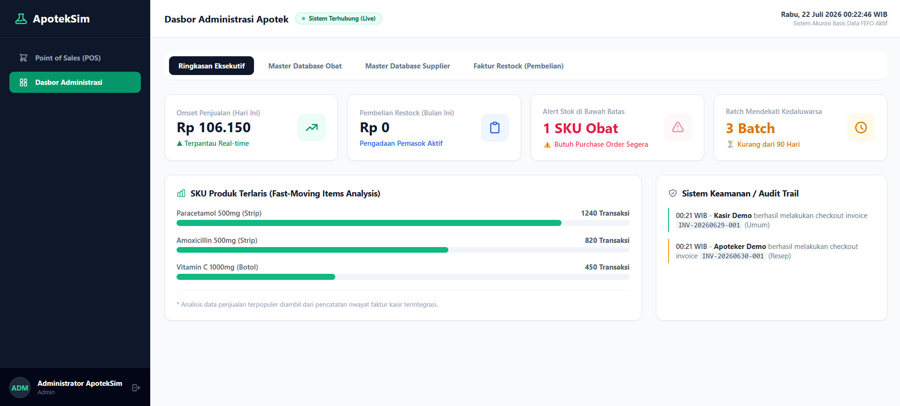
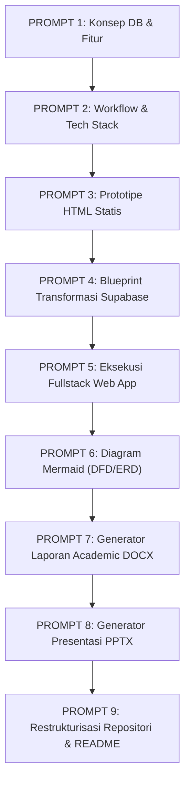
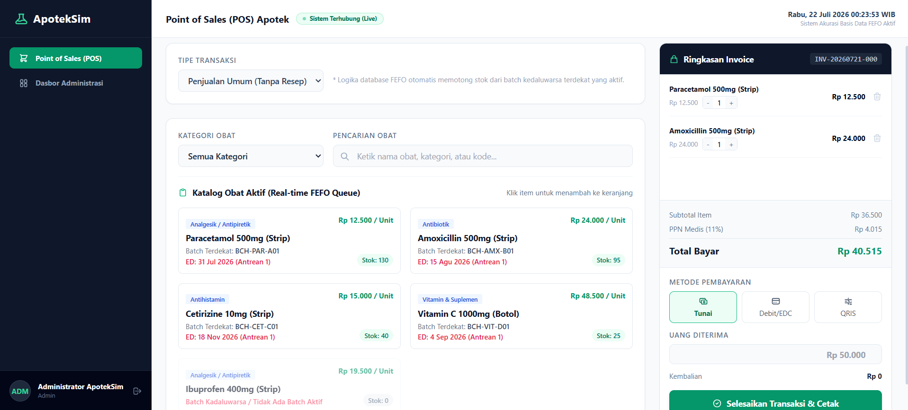
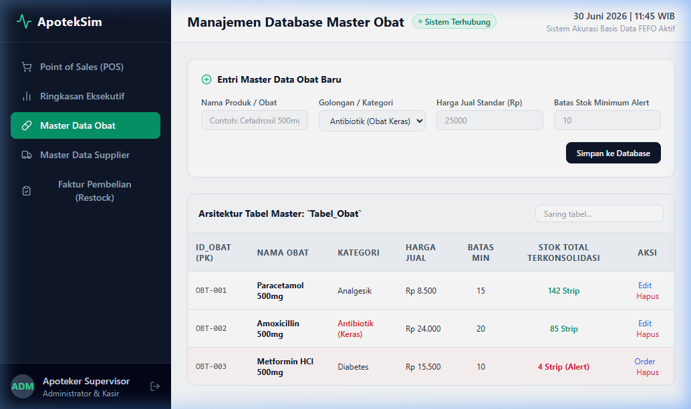
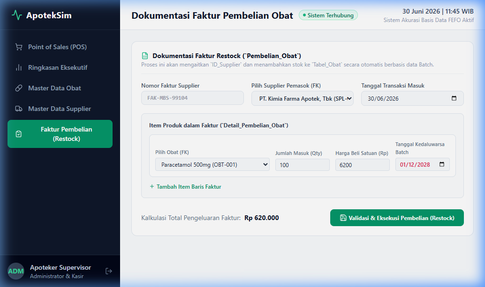
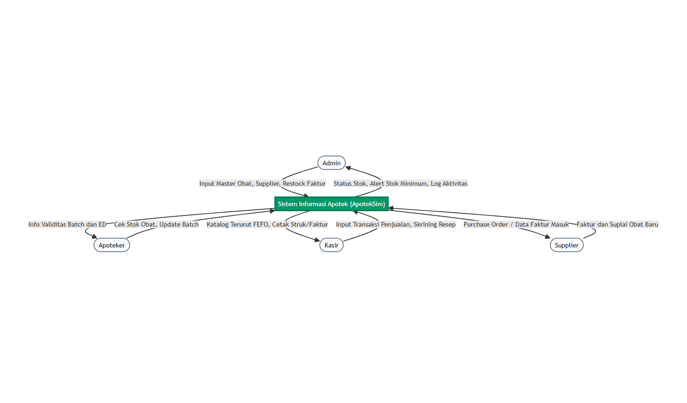
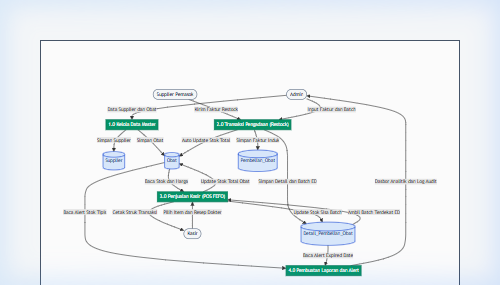
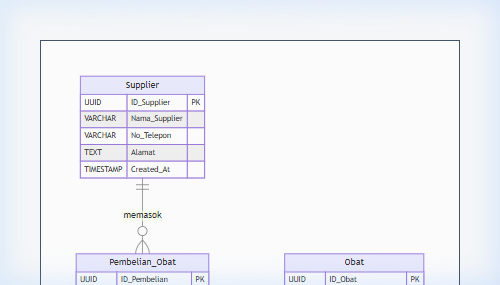

# 🤖 ApotekSim - Sistem Informasi Apotek (AI-Driven Software Engineering)

<div align="center">



### **Tugas Kuliah Project-Based Learning (PBL) - Universitas Dr. Soetomo (UNITOMO)**
**Pembangunan Sistem Informasi Apotek Modern Berbasis AI Assistant, Multi-Batch FEFO, POS Kasir, & Database Row Level Security (RLS)**

[](https://deepmind.google/)
[](https://chatgpt.com/)
[](https://reactjs.org/)
[](https://vitejs.dev/)
[](https://tailwindcss.com/)
[](https://supabase.com/)
[](https://python.org/)

[🖥️ Interactive UI Demo](docs/demo/index.html) • [📜 Master Prompt Pipeline](history-promt.md) • [📄 Laporan Academic (.docx)](docs/reports/laporan_akhir_pbl_apotek.docx) • [📊 Slide Presentasi (.pptx)](docs/reports/presentasi-proyek.pptx)

---

</div>

## 📌 Latar Belakang & Pembuktian AI-Driven Engineering

Proyek ini dibangun sebagai bagian dari **Tugas Kuliah Project-Based Learning (PBL)** di **Universitas Dr. Soetomo (UNITOMO) Surabaya**. 

Fokus utama dari proyek ini adalah **mengimplementasikan Metodologi Pengembangan Perangkat Lunak Berbasis Kecerdasan Buatan (AI-Driven Software Engineering & Prompt Engineering Pipeline)**. Seluruh tahapan pengembangan—mulai dari perancangan arsitektur basis data, prototipe antarmuka (UI), transformasi kode fullstack, otomatisasi diagram sistem, hingga penyusunan laporan akademik `.docx` dan slide presentasi `.pptx`—dieksekusi melalui kolaborasi terstruktur dengan **AI Agent**.

### 🛠️ AI Tools & Teknologi Kecerdasan Buatan yang Digunakan:

| Tool AI / Engine | Peran & Kontribusi Utama dalam Proyek |
| :--- | :--- |
| 🟣 **Google Gemini Antigravity (Agentic AI)** | AI Agent utama untuk *autonomous coding*, pembuatan struktur repositori, refactoring Fullstack React + Supabase, penulisan script generator Python (`docx`/`pptx`), pengujian sistem, dan perapihan repositori. |
| 🟢 **ChatGPT Canvas / OpenAI** | Penyusunan prompt awal, eksperimentasi konsep arsitektur basis data, serta pembentukan berkas panduan transformasi dinamis (`prompt.md`). |
| 🧜‍♂️ **Mermaid.js Engine** | Menghasilkan diagram visual sistem (Diagram Konteks, DFD Level 0, & ERD) secara otomatis via sintaks deklaratif. |
| 🐍 **Python (`python-docx` & `python-pptx`)** | Script otomatisasi berbasis AI untuk meng-generate dokumen Laporan Akhir PBL sesuai margin akademik kaku (4-3-3-3cm) dan slide presentasi 16:9 modern. |

---

## 📜 Master Prompt Pipeline (Petunjuk Prompt Tahap demi Tahap)

Pengembangan proyek ini menggunakan alur **9-Stage Master Prompt Pipeline** yang saling terhubung secara runtut (*interconnected prompt engineering flow*). Setiap tahapan prompt memanfaatkan keluaran dari tahap sebelumnya:



### 📋 Ringkasan Matriks Prompt Engineering:

| Tahap | Fokus Prompt | Input & Prasyarat | Output yang Dihasilkan | Alat AI Utama |
| :---: | :--- | :--- | :--- | :---: |
| **1** | **Arsitektur DB & Fitur** | Spesifikasi Bisnis Apotek | Schema 3 Tabel Utama & Blueprint Fitur Admin/Kasir | ChatGPT / Gemini |
| **2** | **Workflow & Tech Stack** | Hasil Prompt 1 | Alur Bisnis Step-by-Step & Stack React + Supabase | ChatGPT / Gemini |
| **3** | **UI Prototype HTML** | Hasil Prompt 1 & 2 | Single-file UI Prototype [`docs/demo/index.html`](docs/demo/index.html) | ChatGPT Canvas |
| **4** | **Blueprint Migration (`prompt.md`)** | File `index.html` | Dokumentasi Analisis Celah & SoC Guide (`prompt.md`) | ChatGPT Canvas |
| **5** | **Fullstack Execution** | `index.html` & `prompt.md` | Aplikasi Web Modern di [`Frontend/`](Frontend/) & [`Backend/`](Backend/) | **Gemini Antigravity Agent** |
| **6** | **Diagram System Rendering** | Schema DB & Workflow | HTML Diagram Renderers di [`docs/diagrams_html/`](docs/diagrams_html/) | **Gemini Antigravity Agent** |
| **7** | **Academic DOCX Generator** | Data Proyek & Testing | Script [`docs/generators/generate_report.py`](docs/generators/generate_report.py) -> `.docx` | **Gemini Antigravity Agent** |
| **8** | **Presentation PPTX Generator** | Visual Assets & Metrics | Script [`docs/generators/generate_pptx.py`](docs/generators/generate_pptx.py) -> `.pptx` | **Gemini Antigravity Agent** |
| **9** | **Repo Restructuring & README** | Seluruh Berkas Proyek | Folder `docs/` Terorganisir, `.gitignore`, & `README.md` | **Gemini Antigravity Agent** |

> 💡 *Sintaks lengkap dan instruksi rinci dari setiap prompt dapat diakses di dokumen **[history-promt.md](history-promt.md)**.*

---

## ✨ Fitur Utama Sistem Informasi Apotek (ApotekSim)

- **📦 Manajemen Stok FEFO (*First Expired, First Out*)**: Pengeluaran obat otomatis memotong batch dengan tanggal kedaluwarsa paling dekat secara transaksional di database server untuk mencegah obat kadaluwarsa terdistribusi.
- **🛒 Point of Sales (POS) Kasir**: Fitur pencarian cepat obat, kalkulasi total harga otomatis, dan sistem proteksi modal skrining resep dokter untuk obat golongan Obat Keras (G).
- **📊 Dasbor Eksekutif & Peringatan Stok Minimum**: Visualisasi indikator warna real-time untuk pemantauan sisa stok, peringatan obat mendekati expired, dan grafik ringkasan transaksi bulanan.
- **🛡️ PostgreSQL Row Level Security (RLS)**: Penerapan kebijakan keamanan database di mana role Kasir hanya diberi hak akses baca (*SELECT*) dan pemotongan stok transaksional, sedangkan role Admin memiliki akses penuh mutasi data.
- **📑 Document Generator Bawaan**: Script Python mandiri untuk meng-generate dokumen Laporan Akhir PBL akademik (`.docx`) dan slide presentasi 16:9 (`.pptx`) berbasis data live sistem.

---

## 🖼️ Tampilan Antarmuka (UI Showcase)

<div align="center">

| Dasbor Utama Admin | Point of Sales (POS) Kasir |
| :---: | :---: |
|  |  |

| Master Data Katalog Obat | Faktur Pembelian (Restock) |
| :---: | :---: |
|  |  |

</div>

---

## 📐 Diagram Sistem & Perancangan Basis Data

<div align="center">

### **1. Diagram Konteks**

*Alur batas sistem dan interaksi antara entitas eksternal (Admin & Kasir) dengan ApotekSim.*

### **2. Data Flow Diagram (DFD Level 0)**

*Peta aliran data komprehensif mencakup Pengadaan Obat, Stok Multi-Batch, POS Kasir, dan Laporan Eksekutif.*

### **3. Entity Relationship Diagram (ERD)**

*Struktur relasi basis data PostgreSQL dinormalisasi (Tabel Supplier, Obat, Batch Detail, dan Transaksi).*

</div>

---

## 📁 Struktur Repositori Terorganisir

Repositori ini telah dirapikan menggunakan standar struktur yang bersih dan modular:

```gfm
Sistem-Informasi-Apotek/
├── Frontend/                   # Aplikasi Web React + Vite + Tailwind CSS
│   ├── src/                    # Components, Pages, Hooks, & Supabase Client Services
│   ├── package.json            # NPM Dependencies
│   └── vite.config.ts          # Vite Configuration
├── Backend/                    # Backend Configuration & Database
│   └── supabase/               # SQL Schema, Migrations, & RLS Security Policies
├── docs/                       # Dokumentasi Terstruktur & Berkas Generator
│   ├── assets/                 # Screenshot UI & File Diagram (.png/.jpg)
│   ├── reports/                # Laporan Akhir PBL (.docx) & Presentasi (.pptx)
│   ├── generators/             # Script Python Generator (generate_report.py & generate_pptx.py)
│   ├── diagrams_html/          # Renderer Diagram Mermaid.js (render_*.html)
│   ├── demo/                   # Standalone Interactive HTML Prototype (index.html)
│   └── notes/                  # Format Laporan, Prompt Notes, & Master Prompt Pipeline
├── .gitignore                  # Aturan penanganan file sampel, env, & lock files
├── history-promt.md            # Dokumentasi Lengkap Master Prompt Pipeline (Prompt 1 - 9)
└── README.md                   # Dokumentasi Utama Repositori (File Ini)
```

---

## 🚀 Panduan Memulai & Reproduksi Proyek (Getting Started)

### **1. Prasyarat Sistem**
- **Node.js** v18+ dan `npm`
- **Python** 3.10+ (disertai `python-docx`, `python-pptx`, dan `pillow`)
- Akun **Supabase** (untuk database cloud PostgreSQL)

---

### **2. Menjalankan Aplikasi Frontend (React + Vite)**

```bash
# Masuk ke direktori Frontend
cd Frontend

# Install seluruh dependensi
npm install

# Salin dan sesuaikan variabel lingkungan (.env)
cp .env.example .env
# Isikan VITE_SUPABASE_URL dan VITE_SUPABASE_ANON_KEY Anda

# Jalankan server pengembangan lokal
npm run dev
```
Buka browser pada alamat `http://localhost:5173`.

---

### **3. Menjalankan Prototipe Standalone via Browser (Tanpa Installation)**

Anda dapat menguji antarmuka prototipe UI tanpa perlu menjalankan server Node.js:
- Buka berkas **[`docs/demo/index.html`](docs/demo/index.html)** langsung melalui browser.

---

### **4. Menguji Script Python Document Generators**

Untuk meng-generate ulang dokumen Laporan Academic (`.docx`) atau Presentasi (`.pptx`):

```bash
# Pastikan library Python terinstall
py -m pip install python-docx python-pptx pillow

# Menjalankan Generator Laporan Akademia (.docx)
py docs/generators/generate_report.py

# Menjalankan Generator Slide Presentasi (.pptx)
py docs/generators/generate_pptx.py
```
*Hasil file otomatis dibuat dan disimpan di folder **[`docs/reports/`](docs/reports/)**.*

---

## 📑 Indeks Dokumentasi Proyek

- **[📜 Master Prompt Pipeline Guide](history-promt.md)**: Panduan urutan prompt 1-9 dari konsep hingga deployment.
- **[📄 Laporan Akhir PBL (.docx)](docs/reports/laporan_akhir_pbl_apotek.docx)**: Dokumen formal akademik lengkap dengan spasi 1.5 dan margin kaku 4-3-3-3cm.
- **[📊 Slide Presentasi Proyek (.pptx)](docs/reports/presentasi-proyek.pptx)**: Presentation deck 16:9 berdesain profesional.
- **[⚙️ Generator Script Laporan](docs/generators/generate_report.py)**: Script Python pembentuk dokumen Word.
- **[🎨 Generator Script Presentasi](docs/generators/generate_pptx.py)**: Script Python pembentuk slide PowerPoint.

---

## 🎓 Identitas Tugas & Lisensi

- **Mata Kuliah**: Project-Based Learning (PBL) / Sistem Informasi
- **Institusi**: Universitas Dr. Soetomo (UNITOMO) Surabaya

<div align="center">

[](https://unitomo.ac.id/)

<sub>Dikembangkan dengan Pendekatan AI-Driven Engineering • 2026</sub>

</div>
