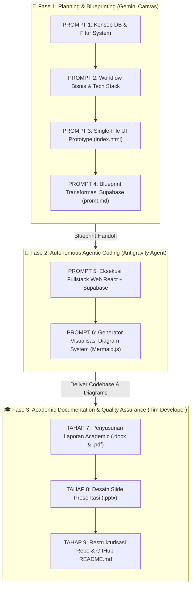

# 🚀 MASTER PROMPT PIPELINE (END-TO-END SYSTEM DEVELOPMENT & DOCUMENTATION)

Dokumen ini berisi alur **Prompt Engineering Terintegrasi (Step-by-Step Prompt Flow)** untuk membangun sistem **ApotekSim** dari nol. Alur ini mencakup perancangan konsep arsitektur basis data, pengembangan aplikasi *Fullstack Web*, otomatisasi diagram visual, penyusunan laporan akademik (`.docx` & `.pdf`), pembuatan slide presentasi (`.pptx`), hingga restrukturisasi repositori dan GitHub `README.md`.

---

## 📌 Alur Keterhubungan Prompt (Pipeline Overview)



---

## 📜 PROMPT 1: Perancangan Arsitektur Basis Data & Blueprint Fitur

**Target**: Merancang konsep arsitektur basis data relasional ternormalisasi dan pemetaan fitur utama sistem manajemen apotek.

**Engine AI**: 🔵 **Gemini Canvas**

**Input Variabel**:
- **Nama Sistem**: `ApotekSim (Sistem Informasi Apotek Modern)`
- **Deskripsi Proyek**: `Sistem Informasi Manajemen Apotek dengan Fitur Multi-Batch FEFO, POS Kasir, Skrining Obat Keras, & Security Database RLS.`

**Instruksi Prompt**:
```text
Tolong rancang Spesifikasi Arsitektur Basis Data (Minimal 3 Tabel Utama):
1. Tabel Master Data Obat (Katalog Produk, Kategori, Batas Minimum Stok)
2. Tabel Master Data Supplier (Mitra Pemasok Obat & Kontak)
3. Tabel Detail Pembelian / Restock & Penjualan Multi-Batch FEFO (Expiry Date & Batch Code)

Tugas Anda:
1. Berikan penjelasan konsep hubungan (relationship/cardinality 1:N dan N:M) antar ketiga tabel tersebut secara profesional.
2. Deskripsikan blueprint fitur-fitur lengkap dan detail yang wajib ada pada sistem ini, baik dari sisi fungsionalitas Kasir (Client-side) maupun Administrator (Dashboard-side).
3. Fokus pada skalabilitas dan fungsionalitas sistem informasi manajemen. JANGAN generate kode pemrograman terlebih dahulu pada tahap ini.
```

---

## 📜 PROMPT 2: Workflow Bisnis Sistem & Rekomendasi Tech Stack

**Target**: Menyusun alur kerja bisnis (*workflow*) sistem secara *end-to-end* dan menetapkan rekomendasi *tech stack* modern berbasis hasil PROMPT 1.

**Engine AI**: 🔵 **Gemini Canvas**

**Instruksi Prompt**:
```text
Berdasarkan arsitektur basis data dan blueprint fitur yang telah dirancang pada PROMPT 1:

Tugas Anda:
1. Buat workflow sistem yang detail dan runtut (Step-by-Step), mulai dari proses inisialisasi data master oleh Admin, transaksi restock dari supplier, transaksi Point of Sales (POS) oleh Kasir, kalkulasi otomatis FEFO (First Expired, First Out), hingga penerbitan laporan penjualan.
2. Berikan rekomendasi tech stack modern yang efisien untuk level pemula hingga menengah dengan memisahkan komponen Frontend (React 18 + Vite 5 + TypeScript + Tailwind CSS 3.4), Backend (Supabase BaaS / PostgreSQL 15), dan Keamanan (Row Level Security - RLS). Berikan alasan teknis mengapa kombinasi teknologi ini sangat direkomendasikan.
```

---

## 📜 PROMPT 3: Prototipe HTML Statis (Single-File Prototype)

**Target**: Menghasilkan berkas HTML statis tunggal (`docs/demo/index.html`) sebagai prototipe visual antarmuka pengguna (Frontend) dan dasbor admin berdasarkan rancangan PROMPT 1 & 2.

**Engine AI**: 🔵 **Gemini Canvas**

**Input File**: Hasil blueprint PROMPT 1 & 2.
**Output File**: [`docs/demo/index.html`](../demo/index.html)

**Instruksi Prompt**:
```text
Berdasarkan blueprint fitur dan alur kerja dari PROMPT 1 dan PROMPT 2, buatkan satu file HTML statis tunggal ("index.html") sebagai prototipe UI visual.

Spesifikasi Kode & UI:
1. Satukan komponen UI ke dalam file HTML yang bersih, terstruktur, dan modular.
2. Gunakan Tailwind CSS (via CDN) dan Lucide Icons untuk kerangka desain modern, estetik, dan responsif.
3. Pastikan seluruh elemen form (input data obat/supplier), modal (skrining resep), dan tampilan data (tabel catalog, kartu stok kritis, faktur restock, serta tab navigation) terimplementasi secara statis agar siap diuji visualnya.
```

---

## 📜 PROMPT 4: Blueprint Transformasi Dynamic Supabase (`promt.md`)

**Target**: Menganalisis file `index.html` dari PROMPT 3 dan menyusun dokumen panduan teknis (`docs/notes/promt.md`) untuk migrasi ke arsitektur dinamis Fullstack React + Supabase.

**Engine AI**: 🔵 **Gemini Canvas**

**Input File**: [`docs/demo/index.html`](../demo/index.html)
**Output File**: [`docs/notes/promt.md`](promt.md)

**Instruksi Prompt**:
```text
Buatkan sebuah dokumen Markdown (.md) dengan nama file "promt.md". Dokumen ini berisi instruksi kerja (blueprint) tertulis untuk memigrasikan prototipe HTML statis ("index.html") menjadi aplikasi web modern berbasis React + Vite + TypeScript dan Supabase.

PENTING: DILARANG GENERATE KODE PEMROGRAMAN APAPUN di dalam promt.md ini. Fokuskan output murni pada analisis arsitektur, teks instruksi, dan bagan struktur folder.

Struktur isi "promt.md" wajib mencakup 4 bagian:
1. DAFTAR PERMASALAHAN & CELAH PADA HTML STATIS (Statelessness, Security Vulnerabilities, Synchronization).
2. STRATEGI TRANSFORMASI FUNGSIONAL KE DYNAMIC (Supabase Auth, CRUD Master, RLS Security, dan Database Stored Procedure RPC untuk FEFO).
3. PRINSIP CLEAN CODE & SEPARATION OF CONCERNS (SoC) (Pemisahan UI Components, Custom Hooks, Supabase Client Service, & Environment Variables).
4. SKEMA STRUKTUR KERANGKA FOLDER PROYEK (Visualisasi pohon direktori /Frontend dan /Backend).
```

---

## 📜 PROMPT 5: Eksekusi Development Fullstack Web App

**Target**: Mengeksekusi refactoring dan membangun arsitektur aplikasi Fullstack secara utuh berdasarkan file `index.html` (PROMPT 3) dan `promt.md` (PROMPT 4).

**Engine AI**: 🤖 **Gemini + Claude (Antigravity Agent)**

**Input File**:
1. [`docs/demo/index.html`](../demo/index.html) -> Kerangka UI statis & modal fitur.
2. [`docs/notes/promt.md`](promt.md) -> Blueprint SoC, RLS rules, dan skema folder.

**Output Repository**:
- [`Frontend/`](../../Frontend/) -> Aplikasi React + Vite + TypeScript + Tailwind.
- [`Backend/supabase/migrations/`](../../Backend/supabase/migrations/) -> SQL Script `0001_init.sql`, `0002_triggers.sql`, `0003_rpcs.sql`.

**Instruksi Prompt**:
```text
Lakukan eksekusi pembangunan aplikasi Fullstack modern berbasis file "index.html" dan panduan teknis pada "promt.md".

Input File yang Digunakan:
1. index.html -> Berisi kerangka UI statis dan modal fitur.
2. promt.md  -> Berisi aturan SoC, Supabase RLS, dan struktur folder.

Tugas Eksekusi AI Agent:
1. Buat struktur folder proyek modular memisahkan folder /Frontend (React + Vite + TypeScript) dan /Backend (Supabase migration & RLS policies).
2. Pecah komponen UI statis dari "index.html" menjadi komponen React modular (Components, Pages, Services, Hooks, Types).
3. Implementasikan fungsi dinamis menggunakan Supabase SDK (Auth, Master Data CRUD, Transaction Stored Procedure RPC FEFO, dan Realtime Subscriptions).
4. Terapkan Environment Variables (.env) untuk VITE_SUPABASE_URL dan VITE_SUPABASE_ANON_KEY.
5. Pastikan seluruh aplikasi dapat dijalankan secara lokal dengan `npm run dev`.
```

---

## 📜 PROMPT 6: Generator Visualisasi Diagram Sistem (Mermaid & HTML)

**Target**: Menghasilkan 3 berkas HTML render diagram interaktif berbasis Mermaid.js untuk Diagram Konteks, DFD Level 0, dan ERD Database.

**Engine AI**: 🤖 **Gemini + Claude (Antigravity Agent)**

**Input File**: Schema Database `0001_init.sql` & Workflow Bisnis.
**Output File**:
- [`docs/diagrams_html/render_konteks.html`](../diagrams_html/render_konteks.html)
- [`docs/diagrams_html/render_dfd0.html`](../diagrams_html/render_dfd0.html)
- [`docs/diagrams_html/render_erd.html`](../diagrams_html/render_erd.html)

**Instruksi Prompt**:
```text
Berdasarkan struktur database dan alur sistem ApotekSim yang telah dibuat pada proyek ini:

Tugas Anda:
1. Buatkan 3 file HTML render diagram interaktif menggunakan pustaka Mermaid.js:
   - `render_konteks.html`: Diagram Konteks hubungan entitas Admin & Kasir dengan sistem.
   - `render_dfd0.html`: Data Flow Diagram (DFD) Level 0 mencakup proses Restock Supplier, Multi-Batch Stok, POS Kasir, dan Laporan Penjualan.
   - `render_erd.html`: Entity Relationship Diagram (ERD) relasi tabel Supplier, Obat, Batch Detail, dan Transaksi.
2. Sediakan sintaks Mermaid.js yang valid dan berikan styling kartu visual yang elegan.
```

---

## 📜 TAHAP 7: Penyusunan Laporan Akhir Akademik (.docx & .pdf)

**Target**: Menyusun dokumen Laporan Akhir PBL format Word (`.docx`) dan PDF (`.pdf`) sesuai standar karya tulis ilmiah universitas.

**Pelaksana**: **Tim Developer** (Fahri Adis Al Hafni, Sahrul Mubarok, Ach Tohir)

**Output File**:
- [`docs/reports/laporan_akhir_pbl_apotek.docx`](../reports/laporan_akhir_pbl_apotek.docx)
- [`docs/reports/laporan_akhir_pbl_apotek.pdf`](../reports/laporan_akhir_pbl_apotek.pdf)

**Pedoman Penyusunan**:
1. **Margin Halaman**: Kiri 4 cm, Atas 3 cm, Kanan 3 cm, Bawah 3 cm.
2. **Jenis Font**: Times New Roman, ukuran 12pt untuk teks utama, spasi 1.5 baris, alignment Justify.
3. **Struktur Dokumen Lengkap**:
   - Judul & Identitas Kelompok (Kampus UNITOMO Surabaya, 3 Anggota Kelompok).
   - BAB I PENDAHULUAN (Latar Belakang, Rumusan Masalah, Tujuan, Manfaat).
   - BAB II LANDASAN TEORI (SIM Apotek, Formulasi Matematika FEFO, React, Supabase, RLS).
   - BAB III ANALISIS & PERANCANGAN SISTEM (Requirements, Schema DB, Diagram Konteks, DFD Level 0, ERD).
   - BAB IV IMPLEMENTASI & PENGUJIANKODING (Development Stack, RLS Rules, Black-box Test Cases TC-01 s/d TC-06).
   - BAB V PENUTUP (Kesimpulan & Saran) & DAFTAR PUSTAKA (Style IEEE/APA).

---

## 📜 TAHAP 8: Desain Slide Presentasi Proyek (.pptx)

**Target**: Menyusun file Slide Presentasi Proyek (`.pptx`) berukuran 16:9 widescreen berdesain modern dan profesional.

**Pelaksana**: **Tim Developer**

**Output File**: [`docs/reports/presentasi-proyek.pptx`](../reports/presentasi-proyek.pptx)

**Spesifikasi Slide**:
1. **Palette Warna**: Dark Mode Modern (Slate Blue `#0F172A`, Emerald Green `#10B981`, Cyan Accent `#06B6D4`, White Card BG).
2. **Struktur Slide (Minimal 8 Slide Utama)**:
   - Slide 1: Title & Team Presentation (Nama Proyek, Kampus UNITOMO, Anggota Kelompok).
   - Slide 2: Problem Statement & Solution Matrix.
   - Slide 3: Core Features Overview (FEFO Engine, POS Kasir, Stock Warning, RLS Security).
   - Slide 4: System Architecture & Tech Stack (React, Vite, Tailwind, Supabase).
   - Slide 5: System Diagrams (Container Card untuk Diagram Konteks, DFD 0, & ERD).
   - Slide 6: Database & RLS Security Rules (Penjelasan RLS & Token JWT).
   - Slide 7: Implementation & Black-box Test Results Table.
   - Slide 8: Conclusion & Future Development.

---

## 📜 TAHAP 9: Restrukturisasi Repositori & Dokumentasi GitHub (`README.md`)

**Target**: Merapikan seluruh file proyek, menghapus file temporary lock, dan menyusun berkas `README.md` utama yang profesional untuk GitHub.

**Pelaksana**: **Tim Developer**

**Output File**: [`README.md`](../../README.md) & [`.gitignore`](../../.gitignore)

**Poin Restrukturisasi**:
1. **Folder Dokumentasi `docs/`**:
   - `docs/assets/`: Screenshot UI (`ui_*.png`), GIF demonstrasi (`demo_system.gif`), diagram (`dfd_level0.png`, `diagram_konteks.png`, `erd_database.png`), dan logo `UNITOMO.jpg`.
   - `docs/reports/`: Dokumen `.docx`, `.pdf`, dan slide `.pptx`.
   - `docs/diagrams_html/`: File HTML diagram Mermaid (`render_*.html`).
   - `docs/demo/`: Prototype standalone HTML (`index.html`).
   - `docs/notes/`: File catatan markdown (`Format-Laporan.md`, `promt.md`, `history-promt.md`).
2. **Aturan `.gitignore`**: Mengabaikan temporary lock files MS Office (`~$*.docx`), `node_modules/`, `.env`, dan `dist/`.
3. **Berkas `README.md`**: Header Badges, Callout Highlights, UI Showcase Grid, System Diagrams, Tree Structure, Quickstart Guide, dan Dokumentasi Index.

---

## 💡 Petunjuk Penggunaan Pipeline

1. **Jalankan Secara Berurutan (Sequential Execution)**: Setiap tahapan bergantung pada keluaran dari tahap sebelumnya.
2. **Pemetaan Resource & Tooling**:
   - **Prompt 1 – 4**: Gunakan **Gemini Canvas** untuk perencanaan arsitektur, workflow, prototipe HTML statis, dan penulisan blueprint migrasi (`promt.md`).
   - **Prompt 5 – 6**: Gunakan **Gemini + Claude (Antigravity Agent)** untuk eksekusi kode Fullstack React + Supabase dan pembuatan diagram Mermaid.
   - **Tahap 7 – 9**: Dilakukan oleh **Tim Developer** untuk penyusunan Laporan, Slide Presentasi, dan Quality Assurance repositori.
