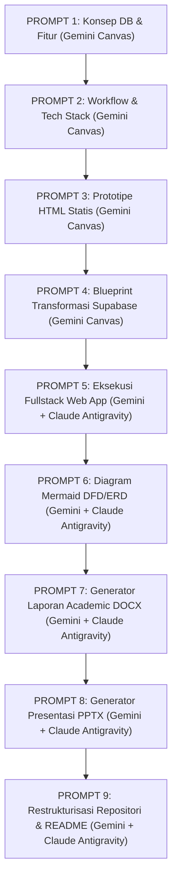

# 🚀 MASTER PROMPT PIPELINE (END-TO-END SYSTEM DEVELOPMENT & DOCUMENTATION)

Dokumen ini berisi rangkaian **Prompt Terhubung (Step-by-Step Prompt Engineering Flow)** untuk membangun proyek dari nol (konsep & arsitektur), pengembangan aplikasi *Fullstack Web*, pembuatan diagram visual, otomatisasi laporan akademik (`.docx`), otomatisasi slide presentasi (`.pptx`), hingga pengorganisasian repositori dan penyusunan GitHub `README.md` yang profesional.

---

## 📌 Alur Keterhubungan Prompt (Pipeline Overview)



---

## 📜 PROMPT 1: Perancangan Arsitektur Basis Data & Blueprint Fitur (Gemini Canvas)

**Target**: Rancang konsep arsitektur basis data relasional dan pemetaan fitur untuk sistem informasi berbasis web.

**Input Variabel**:
- **Nama Sistem**: `[Isi Nama Sistem, misal: ApotekSim]`
- **Deskripsi Proyek**: `[Isi Deskripsi Singkat Proyek]`

**Instruksi Prompt**:
```text
Tolong rancang Spesifikasi Arsitektur Basis Data (Minimal 3 Tabel Utama):
1. Tabel Master 1 (misal: Data Obat / Produk)
2. Tabel Master 2 (misal: Data Supplier / Vendor)
3. Tabel Transaksi (misal: Detail Pembelian / Penjualan Multi-Batch FEFO)

Tugas Anda:
1. Berikan penjelasan konsep hubungan (relationship/cardinality 1:N atau N:M) antar ketiga tabel tersebut secara profesional.
2. Deskripsikan blueprint fitur-fitur lengkap dan detail yang wajib ada pada sistem ini, baik dari sisi fungsionalitas User (Kasir/Client-side) maupun Administrator (Dashboard-side).
3. Fokus pada skalabilitas dan fungsionalitas sistem informasi manajemen. JANGAN generate kode pemrograman terlebih dahulu pada tahap ini.
```

---

## 📜 PROMPT 2: Workflow Sistem & Rekomendasi Tech Stack (Gemini Canvas)

**Target**: Susun alur kerja (*workflow*) sistem yang komprehensif dan tentukan rekomendasi *tech stack* berbasis hasil dari PROMPT 1.

**Instruksi Prompt**:
```text
Berdasarkan arsitektur basis data dan blueprint fitur yang telah dirancang pada PROMPT 1:

Tugas Anda:
1. Buat workflow sistem yang detail dan runtut (Step-by-Step), mulai dari proses inisialisasi data master oleh Admin, interaksi/transaksi yang dilakukan oleh User, hingga validasi akhir di sisi sistem (end-to-end bisnis proses).
2. Berikan rekomendasi tech stack modern yang efisien untuk level pemula hingga menengah dengan memisahkan komponen Frontend (React/Vite), Backend (Supabase/PostgreSQL), dan Styling (Tailwind CSS). Berikan alasan teknis mengapa kombinasi teknologi ini sangat direkomendasikan.
```

---

## 📜 PROMPT 3: Prototipe HTML Statis (Gemini Canvas)

**Target**: Generate kode implementasi berbasis HTML statis untuk merepresentasikan antarmuka pengguna (Frontend) dan dashboard admin berdasarkan rancangan PROMPT 1 & 2.

**Instruksi Prompt**:
```text
Berdasarkan blueprint fitur dan alur kerja dari PROMPT 1 dan PROMPT 2, buatkan satu file HTML statis tunggal ("index.html") sebagai prototipe UI visual.

Spesifikasi Kode & UI:
1. Satukan komponen UI ke dalam file HTML yang bersih, terstruktur, dan modular.
2. Gunakan Tailwind CSS (via CDN) dan Lucide Icons untuk kerangka desain modern, estetik, dan responsif.
3. Pastikan seluruh elemen form (input data), modal, dan tampilan data (tabel, kartu informasi, katalog obat, faktur restock, serta tab navigation) sudah terimplementasi secara statis agar siap diuji visualnya.
```

---

## 📜 PROMPT 4: Blueprint Transformasi Dynamic Supabase (`prompt.md`) (Gemini Canvas)

**Target**: Analisis file "index.html" dari PROMPT 3 dan buatkan dokumen panduan arsitektur (`prompt.md`) untuk migrasi ke React + Supabase.

**Instruksi Prompt**:
```text
Buatkan sebuah dokumen Markdown (.md) dengan nama file "prompt.md". Dokumen ini berisi instruksi kerja (blueprint) tertulis untuk memigrasikan prototipe HTML statis ("index.html") menjadi aplikasi web modern menggunakan Next.js/Vite dan Supabase.

PENTING: DILARANG GENERATE KODE PEMROGRAMAN APAPUN di dalam prompt.md ini. Fokuskan output murni pada analisis arsitektur, teks instruksi, dan bagan struktur folder.

Struktur isi "prompt.md" wajib mencakup 4 bagian:
1. DAFTAR PERMASALAHAN & CELAH PADA HTML STATIS (Statelessness, Security Vulnerabilities, Synchronization).
2. STRATEGI TRANSFORMASI FUNGSIONAL KE DYNAMIC (Supabase Auth, CRUD Master, RLS, dan Database Transactions/RPC untuk FEFO).
3. PRINSIP CLEAN CODE & SEPARATION OF CONCERNS (SoC) (Pemisahan UI/Views, Business Logic Hooks, Supabase Client, & Environment Variables).
4. SKEMA STRUKTUR KERANGKA FOLDER PROYEK (Visualisasi pohon direktori /Frontend dan /Backend).
```

---

## 📜 PROMPT 5: Eksekusi Development Fullstack Web App (Gemini + Claude Antigravity)

**Target**: Lakukan refactoring dan bangun arsitektur aplikasi Fullstack secara utuh berdasarkan file "index.html" (PROMPT 3) dan "prompt.md" (PROMPT 4).

**Instruksi Prompt**:
```text
Lakukan eksekusi pembangunan aplikasi Fullstack modern berbasis file "index.html" dan panduan teknis pada "prompt.md".

Input File yang Digunakan:
1. index.html -> Berisi kerangka UI statis dan modal fitur.
2. prompt.md  -> Berisi aturan SoC, Supabase RLS, dan struktur folder.

Tugas Eksekusi AI Agent:
1. Buat struktur folder proyek modular memisahkan folder /Frontend (React + Vite) dan /Backend (Supabase migration & RLS policies).
2. Pecah komponen UI statis dari "index.html" menjadi komponen React yang modular (Views, Layouts, Components, UI Elements).
3. Implementasikan fungsi dinamis menggunakan Supabase SDK (Auth, Master Data CRUD, Transaction RPC/FEFO, dan Realtime Subscriptions).
4. Terapkan Environment Variables (.env) untuk VITE_SUPABASE_URL dan VITE_SUPABASE_ANON_KEY.
5. Pastikan seluruh aplikasi dapat dijalankan secara lokal dengan `npm run dev`.
```

---

## 📜 PROMPT 6: Generator Visualisasi Diagram Sistem (Gemini + Claude Antigravity)

**Target**: Buat diagram sistem interaktif (Diagram Konteks, DFD Level 0, dan ERD) berbasis struktur basis data dari PROMPT 1 & 5.

**Instruksi Prompt**:
```text
Berdasarkan struktur database dan alur sistem yang telah dibuat pada proyek ini:

Tugas Anda:
1. Buatkan 3 file HTML render diagram interaktif menggunakan pustaka Mermaid.js:
   - `render_konteks.html`: Diagram Konteks hubungan entitas Admin & Kasir dengan sistem.
   - `render_dfd0.html`: Data Flow Diagram (DFD) Level 0 mencakup proses Pengadaan, Stok Batch, POS Kasir, dan Laporan.
   - `render_erd.html`: Entity Relationship Diagram (ERD) relasi tabel Supplier, Obat, Batch Detail, dan Transaksi.
2. Sediakan sintaks Mermaid.js yang valid dan berikan styling kartu visual yang elegan.
```

---

## 📜 PROMPT 7: Otomatisasi Script Generator Laporan Akhir Akademia (Gemini + Claude Antigravity)

**Target**: Buat script Python bawaan (`generate_report.py`) yang menggunakan `python-docx` untuk menghasilkan dokumen Laporan Akhir PBL berkriteria akademik kaku secara otomatis.

**Instruksi Prompt**:
```text
Buatkan sebuah script Python ("generate_report.py") yang secara otomatis menghasilkan dokumen Laporan Akhir PBL format Word (.docx) berdasarkan seluruh data arsitektur, fitur, dan pengujian sistem pada proyek ini.

Ketentuan Format Akademik Kaku:
1. Margin Halaman: Kiri 4 cm, Atas 3 cm, Kanan 3 cm, Bawah 3 cm.
2. Jenis Font: Times New Roman, ukuran 12pt untuk teks utama, spasi 1.5 baris, alignment Justify.
3. Struktur Dokumen Lengkap:
   - Judul & Identitas Kelompok (Kampus UNITOMO, 3 Anggota Kelompok).
   - BAB I PENDAHULUAN (Latar Belakang, Rumusan Masalah, Tujuan, Manfaat).
   - BAB II TINJAUAN PUSTAKA (Teori Sistem Informasi, FEFO, React, Supabase, RLS).
   - BAB III ANALISIS & PERANCANGAN SISTEM (Diagram Konteks, DFD Level 0, ERD, Deskripsi Tabel & RLS).
   - BAB IV IMPLEMENTASI & PENGUJIANKODING (Tampilan UI, Hasil Black-box Testing Test Cases).
   - BAB V PENUTUP (Kesimpulan & Saran) & DAFTAR PUSTAKA (Style IEEE/APA).
4. Pastikan script dapat dijalankan dengan command `python generate_report.py` dan menyimpan output ke folder target yang ditentukan.
```

---

## 📜 PROMPT 8: Otomatisasi Script Generator Slide Presentasi (Gemini + Claude Antigravity)

**Target**: Buat script Python bawaan (`generate_pptx.py`) yang menggunakan `python-pptx` untuk menghasilkan file Presentasi Proyek (.pptx) 16:9 berdesain modern dan interaktif.

**Instruksi Prompt**:
```text
Buatkan script Python ("generate_pptx.py") untuk meng-generate file Slide Presentasi Proyek (.pptx) berukuran 16:9 widescreen dengan kualitas visual tingkat tinggi.

Spesifikasi Slide & Desain:
1. Palette Warna: Dark Mode Modern (Slate Blue #0F172A, Emerald Green #10B981, Cyan Accent #06B6D4, White Card BG).
2. Struktur Slide (Minimal 8 Slide Utama):
   - Slide 1: Title & Team Presentation (Nama Proyek, Kampus, Anggota Kelompok).
   - Slide 2: Problem Statement & Solution Matrix.
   - Slide 3: Core Features Overview (FEFO, POS, Stock Warning, RLS Security).
   - Slide 4: System Architecture & Tech Stack (React, Vite, Tailwind, Supabase).
   - Slide 5: System Diagrams (Container Card untuk Diagram Konteks, DFD 0, & ERD).
   - Slide 6: Database & RLS Security Rules (Penjelasan RLS & Token JWT).
   - Slide 7: Implementation & Black-box Test Results Table.
   - Slide 8: Conclusion & Future Development.
3. Otomatiskan peletakan gambar diagram dari folder assets ke dalam container card slide.
```

---

## 📜 PROMPT 9: Restrukturisasi Repositori & Dokumentasi GitHub (Gemini + Claude Antigravity)

**Target**: Rapikan seluruh file dokumentasi (`.docx`, `.png`, `.py`, `.html`, `.md`), hapus file sampah/lock, dan buatkan berkas `README.md` utama yang memikat untuk GitHub.

**Instruksi Prompt**:
```text
Rapikan seluruh berkas dokumentasi dan struktur luar repositori proyek ini agar siap di-push ke GitHub dengan tampilan yang sangat profesional dan rapi.

Tugas Eksekusi Anda:
1. Buat struktur folder dokumentasi `docs/`:
   - `docs/assets/`: Simpan seluruh screenshot UI (`ui_*.png`), diagram (`dfd_level0.png`, `diagram_konteks.png`, `erd_database.png`), dan logo `UNITOMO.jpg`.
   - `docs/reports/`: Simpan dokumen `.docx` dan slide `.pptx`.
   - `docs/generators/`: Simpan script Python generator (`generate_report.py`, `generate_pptx.py`).
   - `docs/diagrams_html/`: Simpan file HTML diagram Mermaid.
   - `docs/demo/`: Simpan prototype standalone HTML (`index.html`).
   - `docs/notes/`: Simpan file catatan markdown (`Format-Laporan.md`, `promt*.md`).
2. Perbarui path relasi pada script Python generator agar mengarah secara dinamis ke sub-folder `docs/`.
3. Buat file `.gitignore` di root repositori untuk mengabaikan temporary lock files MS Office (`~$*.docx`), `node_modules/`, `.env`, `dist/`, dan cache Python (`__pycache__/`).
4. Buat file `README.md` utama di root yang dilengkapi dengan:
   - Header Badges (React, Vite, Supabase, Tailwind, Python).
   - Showcase UI Grid Table (screenshot tampilan fitur).
   - Embedded Diagram Konteks, DFD 0, dan ERD.
   - Tree Diagram Struktur Repositori.
   - Quickstart Installation Guide & Python Execution Guide.
   - Indeks Link Dokumentasi Lengkap.
```

---

## 💡 Petunjuk Penggunaan

1. **Jalankan Secara Berurutan (Sequential Execution)**: Jangan melompati prompt. Setiap prompt dirancang bergantung pada masukan/keluaran dari prompt sebelumnya.
2. **AI Tool Mapping**:
   - **Step 1 - 4**: Gunakan **Gemini Canvas** untuk perencanaan arsitektur, workflow, prototipe HTML statis, dan penulisan blueprint migrasi (`prompt.md`).
   - **Step 5 - 9**: Gunakan **Gemini + Claude (Antigravity Agent)** untuk eksekusi kode Fullstack, pembuatan diagram Mermaid, pembuatan script generator Python (`.docx`/`.pptx`), serta perapihan repositori dan penyusunan `README.md`.
3. **Hasil Akhir**: Mengikuti 9 tahapan prompt ini secara utuh akan menghasilkan **repositori web app fullstack production-ready** beserta **dokumentasi laporan & presentasi lengkap**.
